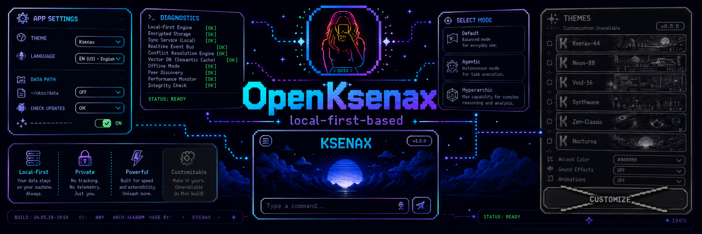

# Ksenax — A Graphical Shell Application for Orchestrating a Local Mobile Model in Agent Mode with Restricted Tools

**Ksenax** _**(Kolesnikov's Essential Neural-Agentic Experience)**_ is an experimental **local-first** Android application designed to explore on-device agent workflows using **Google Gemma** family models, **LiteRT-LM**, and a strictly controlled Kotlin-based tool execution layer (orchestrating device actions through the capabilities of a local AI model).

The project is intended to be fully open source. The repository contains the Android application source code, Gradle configuration, UI resources, and public technical documentation. Large model files, local IDE state, signing keys, generated APKs, and machine-specific configuration are intentionally excluded from the repository and distributed separately through releases.

## Current Status

The project is currently in an intermediate **MVP (Minimum Viable Product)** stage and is being developed as a research-oriented Android shell for a local AI agent.

Core principles:

- model artifacts are downloaded at runtime instead of being bundled into the APK;
    
- the application's architecture is primarily designed around the open multimodal **Gemma-4-E2B-it** model in its **LiteRT-LM API** variant;
    
- whenever possible, all model-driven actions are executed entirely on the local device;
    
- all Android actions must pass through explicit Kotlin-side allowlists and permission checks.
    

## Repository Contents

The public repository is expected to include:

- `app/src/main` — Android application source code, `AndroidManifest`, Jetpack Compose UI, and resources;
    
- `app/src/test` and `app/src/androidTest` — unit and instrumentation tests;
    
- `gradle/`, `gradlew`, `gradlew.bat` — Gradle Wrapper and version catalog;
    
- `build.gradle.kts`, `settings.gradle.kts`, `gradle.properties` — project build configuration;
    
- `AGENTS.md` — documentation describing the overall architecture and project concepts for AI coding agents (such as Claude Code, Codex App, and others);
    
- `metadocs/` — public technical notes prepared for publication.
    

The repository **intentionally does not include**:

- Android Studio local state;
    
- local Android SDK paths;
    
- Gradle and Kotlin caches;
    
- generated APK or AAB artifacts (see Releases);
    
- signing keys or release credentials;
    
- downloaded model weights or local model caches;
    
- private research notes that have not yet been prepared for publication.
    

## Build Requirements

To build the project from source, install:

- Android Studio or Android SDK Command-line Tools;
    
- an Android SDK version compatible with the project's `compileSdk`;
    
- JDK 21 (or allow Gradle to provision the configured toolchain automatically);
    
- Git.
    

When opening the project, Android Studio will typically generate a `local.properties` file automatically. This file contains the local Android SDK path and **must never be committed to Git**.

## Building from Source

Clone the repository:

```powershell
git clone <repo-url>
cd ksenax-local-mobile
```

Build a debug APK:

```powershell
.\gradlew.bat :app:assembleDebug
```

On Linux or macOS:

```bash
./gradlew :app:assembleDebug
```

The generated debug APK will be located in:

```text
app/build/outputs/
```

The entire `app/build/` directory is excluded from version control.

## Installing on a Connected Device

Enable **Developer Options** and **USB Debugging** on your Android device, connect it using a data-capable USB cable, and run:

```powershell
.\gradlew.bat :app:installDebug
```

Alternatively, open the project in Android Studio, select the connected device, and press **Run (`Shift + F10`)**.

## Release Builds

...

## Model Files

Gemma and LiteRT-LM model files are large and **are not included in this repository**.

The application is designed around runtime model delivery: the APK remains lightweight while model artifacts are downloaded and verified separately on the target device.

Model licenses and usage terms are independent from the application's source code license. Anyone forking the project should review the licensing terms of the corresponding model provider before redistributing model artifacts.

## Notes for Potential Forks

Fork maintainers are free to modify the user interface, add new local tools, replace the model backend, or experiment with their own agent orchestration approaches.

However, one fundamental safety rule must always be respected:

**Model output must never be executed directly.** It must:

1. be parsed into a structured tool invocation;
    
2. be validated against an allowlist;
    
3. be checked against the required Android permissions;
    
4. only then be mapped to an actual device action.
    

## License

The project is intended to be fully open source.

The repository includes a `LICENSE` file under the **Apache License 2.0**, allowing users and contributors to clearly understand the terms governing the use, modification, and distribution of the project.
