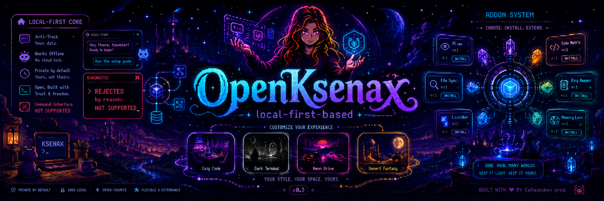
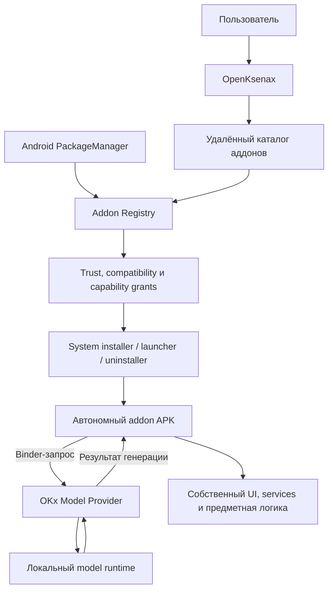

<p align="center">      </p>

# OpenKsenax Mobile (OKx) — платформа для оркестрации локальных больших языковых моделей (LLM) путём интеграции в систему самостоятельных аддонов (add-ons).

## Что за проект? В чём заключается идея и философия?

**OpenKsenax** **_(OKx, Open Kolesnikov's Essential Neural-Agentic Experience)_** — это полноценная исследовательская платформа на Android, позволяющая:

- Как общаться с нейросетью в *разных прикладных режимах* (базовый и временный чаты, агентный с ограничениями);
- Так и проводить эксперименты с самостоятельными аддонами, каждый из которых является конкретной интересной реализацией того или иного аспекта автоматизации.

В целом проект базируется вокруг идеи **local-first AI**:

- модель устанавливается и запускается на устройстве;
- пользовательские команды обрабатываются локально, когда это технически возможно (доступ по API не предусматривается и/или только в будущем);
- Android-действия выполняются не моделью напрямую, а через контролируемые Kotlin-области (инструменты/аддоны);
- каждый инструмент проходит через разрешённый список, проверку прав доступа и проверку политик;
- каждый аддон предоставляет свою политику, к которой OpenKsenax не имеет отношения, открывая доступ только к модели через провайдер;
- большие модельные файлы не вшиваются в APK, а доставляются отдельно.

Иными словами, OpenKsenax — не просто «магический автопилот телефона» или «волшебное приложение, разруливающее проблемы», а это серьёзная попытка построить **воспроизводимую, безопасную и расширяемую Android-платформу для локального ИИ-агента и оркестрации через отдельные модули (addon-APKs)**.

---

## Почему проект интересен

OpenKsenax 0.4 развивает архитектуру мобильной платформы, в которой локальная модель и прикладные сценарии разделены между независимыми Android-приложениями.

OKx предоставляет общую инфраструктуру:

- каталог опубликованных аддонов;
- проверку APK, версии и сертификата;
- установку, обновление, открытие и удаление аддонов;
- контролируемый IPC-доступ к локальной модели;
- единый контур доверия и совместимости.

Каждый аддон остаётся самостоятельным Android-приложением. Он владеет своим UI, сервисами, разрешениями, хранилищем, жизненным циклом и предметной логикой. OKx не загружает чужой DEX в свой процесс и не встраивает Compose-классы аддона в собственный интерфейс.

Android задаёт реальные ограничения:

- установку и удаление APK подтверждает пользователь;
- доступ к системным возможностям регулируют permissions;
- приложения работают в разных процессах и sandbox;
- IPC-вызов требует проверки UID, package name и сертификата;
- модельный вывод остаётся недоверенными данными.

OpenKsenax связывает автономные аддоны с локальным model runtime, сохраняя Android-границы между ними.


```mermaid
flowchart TD
    U["Пользователь"] --> OKX["OpenKsenax"]

    OKX --> C["Удалённый каталог аддонов"]
    PM["Android PackageManager"] --> R["Addon Registry"]
    C --> R

    R --> V["Trust, compatibility и capability grants"]
    V --> S["System installer / launcher / uninstaller"]
    S --> A["Автономный addon APK"]

    A -->|"Binder-запрос"| MP["OKx Model Provider"]
    MP --> M["Локальный model runtime"]
    M --> MP
    MP -->|"Результат генерации"| A

    A --> L["Собственный UI, services и предметная логика"]
```

---

## Ключевые возможности

- 🛠 **Tool Registry**  
    Все доступные действия представлены как явно описанные инструменты.

- 🔒 **Policy-based execution**  
    Модель не может выполнить действие напрямую. Каждый вызов проходит проверку.

- 📊 **Research-oriented metrics**  
    Проект предполагает измерение latency, success rate, tool-call accuracy и отказов по policy.

- 🧩 **Autonomous addon APK platform**  
	Каждый аддон работает как отдельное Android-приложение со своим UI, сервисами, разрешениями и данными.

- 📚 **Remote addon catalog**  
	  OKx получает опубликованный каталог без перекомпиляции host-приложения и показывает доступные к установке аддоны.

- 🎙 **Voice-ready direction**  
    Проект развивается в сторону голосового взаимодействия через push-to-talk и локальный агентный контур.

- 🔍 **Discovery and Registry**  
	  Платформа сопоставляет записи каталога с APK, которые Android действительно видит установленными на устройстве.

- 🔐 **Centralized Trust Validation**  
	  Package name, версия протокола, возможности и signing certificate проверяются в одном registry-контуре.

- 📦 **Verified APK installation**  
	  Загруженный APK проходит проверку URL, размера, SHA-256, package identity, версии и сертификата перед передачей системному installer.

- 🧠 **OKx Model Provider**  
	  Доверенные аддоны запрашивают локальную генерацию через ограниченный Binder API и не загружают модель самостоятельно.

- 📱 **Android-native implementation**  
	  Kotlin, Jetpack Compose, Coroutines, Flow, Room, Ktor и нативные Android API.

- ⚡ **Local model runtime**  
	  Модели работают на устройстве через LiteRT-LM. Модельные артефакты поставляются отдельно и не включаются в APK.

- 🧱 **Process isolation**  
	  OKx и аддоны работают в отдельных Android-процессах. Аддон не передаёт host-приложению исполняемый DEX или Compose UI.

- 🔄 **Independent addon lifecycle**  
	  Аддон можно установить, обновить, открыть или удалить отдельно от OpenKsenax.

---

## Безопасная ментальная модель

Главное правило проекта:

> **Model output must never be executed directly.**


### OKx Mobile (до версии 0.3):

Любой ответ модели должен пройти несколько этапов:

1. поступление исходного инференса в планировочный этап оркестрации локальной модели
2. быть разобран в структурированный вызов инструмента;
3. пройти проверку имени инструмента по allowlist;
4. пройти проверку аргументов;
5. пройти проверку Android-разрешений;
6. пройти проверку уровня риска;
7. при необходимости запросить подтверждение пользователя (*пока функционал не нуждается в подтверждении, однако логика внутри уже содержится*);
8. только после этого быть сопоставлен с реальным Android-действием.

### OKx Mobile (начиная с версии 0.3):

Защита охватывает весь пусть от удалённого каталога до выполнения сценария:

1. OKx декодирует и валидирует внешний каталог аддонов.
2. Загрузчик принимает только разрешённые HTTPS-адреса и ограничивает размер файла.
3. Verifier проверяет SHA-256, package name, version code и signing certificate APK.
4. Установку и удаление выполняет Android с явным участием пользователя.
5. `PackageManager` подтверждает, какой APK действительно установлен.
6. Registry вычисляет доверие, совместимость и доступные host capabilities.
7. Model Provider проверяет Binder UID, package name и registry verdict вызывающего аддона.
8. Аддон получает только заявленные и разрешённые возможности.
9. Сам аддон применяет собственные permissions, policy и пользовательские подтверждения.
10. Ответ модели остаётся данными, пока конкретный доверенный компонент не проверит и не обработает его.

> OpenKsenax не предоставляет аддону неограниченный доступ к устройству. Android права доступа, системная песочница, значимые сертификаты и политика конкретного аддона остаются границами исполнения.

---

## Что OpenKsenax НЕ делает

Проект намеренно не строится вокруг опасной идеи “LLM сама управляет всем телефоном”.

Ksenax не должен:

- выполнять произвольный код из ответа модели;
- скрыто управлять устройством без согласия пользователя;
- обходить Android permission model;
- тихо включать/выключать системные функции, недоступные обычному приложению;
- автоматически кликать по любым приложениям без политики и ограничений;
- выполнять коммуникационные действия без подтверждения пользователя;
- отправлять пользовательские секреты в облачные LLM-приложения.

Это исследовательский проект про **контролируемую агентность**, а не про безлимитную автоматизацию.

---

## Текущий статус

Проект находится в стадии активной разработки и постоянного промежуточного MVP (с прикручиванием нового функционала).

Текущая цель — построить устойчивую Android-оболочку, в которой можно исследовать:

- локальный чат с моделью (в трёх режимах: *«basic»* — обычный текстовый, *«agentic»* — agent-based, *«temporaric»* — обычный текстовый чат, который не индексируется и не сохраняется в памяти);
- доставку модельных артефактов во время выполнения;
- безопасный вызов инструментов (tool-calling);
- голосовое взаимодействие (voice-first);
- слой политик для Android-действий;
- addon-систему (с уже доступным первым аддоном «NO RADAR»);
- сравнение локальных моделей и режимов исполнения.

🔗 *NO RADAR GitHub*:
- https://github.com/CallesnikovProduction/no-radar-addon-open-source

---

## Доступный набор ограниченных инструментов (agentic mode)

| Tool                            | Назначение                                             | Комментарий                                                                                                                                                                               |
| ------------------------------- | ------------------------------------------------------ | ----------------------------------------------------------------------------------------------------------------------------------------------------------------------------------------- |
| `torch_on`                      | Включить фонарик устройства                            | Работает через FunctionGemma OneShot. Быстрый `NonPlanable` tool.                                                                                                                         |
| `torch_off`                     | Выключить фонарик устройства                           | Работает через FunctionGemma OneShot. Для фраз типа “выключить фонарь” добавлены расширенные keywords.                                                                                    |
| `torch_toggle`                  | Переключить фонарик                                    | Используется для короткого запроса вроде “фонарик”. Состояние определяется по последнему состоянию, которое запрашивало приложение.                                                       |
| `alarm_at_time`                 | Поставить будильник на конкретное локальное время      | Например: “поставь будильник на 19:00”. Android-будильник создаётся через системное приложение “Часы”.                                                                                    |
| `alarm_after_minutes`           | Поставить один или несколько будильников через N минут | Например: “поставь 20 будильников через 4 минуты”. Количество и минуты извлекаются локальным draft-слоем, чтобы FunctionGemma не путала числа.                                            |
| `alarm_after_hours`             | Поставить один или несколько будильников через N часов | Например: “поставь 5 будильников через 10 часов”. Количество и часы также нормализуются локально.                                                                                         |
| `alarm_at_date_time`            | Поставить будильник на точную дату и время             | Поддержка есть в контракте, но системный AlarmClock ограничен ближайшими 24 часами; для дальних дат лучше календарь/app-alarm контур.                                                     |
| `alarm_clear_all`               | Попытаться отключить все системные будильники          | Использует Android `ACTION_DISMISS_ALARM` + `ALARM_SEARCH_MODE_ALL`. Не гарантирует удаление записей из приложения “Часы”; поддержка зависит от системного Clock/OEM.                     |
| `calendar_event_create`         | Создать событие в календаре                            | Планируемый tool через Gemma-4 + FunctionGemma. Executor сам переводит локальную дату/время в millis. Сейчас календарный контур ещё самый рискованный и требует живого теста на телефоне. |
| `obsidian_note_write`           | Записать markdown-заметку                              | Планируемый tool. Gemma-4 генерирует содержимое, FunctionGemma только подтверждает function-call, executor пишет в markdown. Сейчас запись идёт в дневную заметку.                        |
| `obsidian_note_append_analysis` | Дописать анализ в markdown-заметку                     | Контракт есть, но полноценный сценарий “найди нужную заметку по названию и допиши туда анализ” ещё не завершён: нет отдельного tool для списка md-файлов/поиска кандидата.                |
| `create_or_edit_markdown_note`  | Низкоуровневый executor записи markdown                | Это не FunctionGemma-facing tool, а внутренний Android/storage executor, который реально пишет файл. Используется Obsidian OneShot-адаптером.                                             |

---

## Модельная стратегия

OpenKsenax ориентирован на локальные модели и edge-runtime.

Основное направление:

- **Gemma 4 E2B / E4B** — reasoning, planning, multimodal direction;
- **FunctionGemma** — специализированный action-router;
- **Vosk** — лёгкая модель для расшифровки голоса на русском (STT);
- **EmbeddingGemma / local embeddings** *(вектор развития)* — будущий слой локальной памяти и RAG.

> *Также планируется гибкое отображение контекстного окна для чатов.*

---

## Установка

Установку рекомендуется производить из раздела GitHub Releases, однако можно вручную собрать проект по способам ниже.

---

## Сборка из исходников

Клонировать репозиторий:

```
git clone <repo-url>
cd ksenax-local-mobile
```

Собрать debug APK на Linux/macOS:

```
./gradlew :app:assembleDebug
```

Собрать debug APK на Windows:

```
.\gradlew.bat :app:assembleDebug
```

APK будет создан в директории:

```
app/build/outputs/
```

Вся директория `app/build/` исключена из Git.

---

## Установка на устройство

Включите на Android-устройстве:

1. Developer Options;
2. USB Debugging.

Затем подключите устройство и выполните:

```
./gradlew :app:installDebug
```

На Windows:

```
.\gradlew.bat :app:installDebug
```

Также можно открыть проект в Android Studio, выбрать устройство и нажать **Run** (с заранее подключенным устройством с USB-отладкой).

---

## Требования для сборки

Для сборки проекта из исходников понадобится:

- Android Studio или Android SDK Command-line Tools;
- Android SDK, совместимый с `compileSdk` проекта;
- JDK 21 или Gradle toolchain;
- Git;
- устройство или эмулятор Android для запуска.

---

## Файлы локальных моделей

Модельные файлы Gemma / LiteRT-LM являются крупными артефактами и не включаются в репозиторий.

Ksenax проектируется вокруг runtime model delivery:

```
APK остаётся лёгким
    ↓
модель скачивается НЕПОСРЕДСТВЕННО через настройки приложения
    ↓
артефакт проверяется всякий раз при заходе в чат/приложение
    ↓
модель подключается локально
```

Лицензии моделей не равны лицензии исходного кода приложения. Перед распространением модельных артефактов необходимо отдельно проверить условия соответствующего поставщика модели.

> Система токенизации находится на ранней разработке. Прозрачность настройки окна контекста временно отсутствует.

---

## Стратегия проекта

OpenKsenax развивается как **GitHub-first / research-first** проект.

Приоритеты:

1. корректная архитектура;
2. безопасность;
3. воспроизводимость;
4. local-first вызов;
5. измеримые результаты;
6. чистый Kotlin/Android код;
7. расширяемость через tools и addons.

Это не быстрый демонстрационный чат поверх LLM.

Это попытка собрать настоящий мобильный агентный runtime, в котором модель — только один из компонентов, а не бог из машины.

> *Из-за будущего внедрения AccessibilityService API проект потенциально не может считаться и ни в коем случае прямо не претендует на Google Play-ready приложение. Play-политики сильно валидируют AccessibilityService, следовательно автор изначально подразумевает GitHub-only публикацию.*

---

## Для форков

Форк-мейнтейнеры могут:

- менять UI;
- добавлять новые tools;
- заменять model backend;
- экспериментировать с Gemma / Phi / другими локальными моделями;
- добавлять свои execution policies;
- расширять addon-систему (в качестве общего форка);
- подключать внешний sidecar;
- строить собственные исследовательские бенчмарки.

Но базовое правило должно сохраняться:

> **Ни один модельный output не должен исполняться напрямую.**

Если модель предлагает действие, приложение обязано проверить его через детерминированный Kotlin-контур.

> *Система аддонов сейчас закрыта для дополнения из соображений безопасности. В будущем планируется масштабная поддержка addon-системы без внедрения форкоделами вовнутрь исходного кода, а также публикация собственных аддонов и динамическая подгрузка в OpenKsenax.*

---

## Лицензия

Проект планируется как полностью открытый с открытым исходным кодом (non-Play-based).

Исходный код распространяется под лицензией **Apache License 2.0**.

См. файл:

```
LICENSE
```

Модельные файлы, сторонние компоненты времени выполнения и внешние зависимости могут иметь собственные лицензии и условия использования.

---

## Автор

Я разрабатываю OpenKsenax как личный open-source исследовательский проект и практическое портфолио Kotlin / Android-разработчика.

В проекте я работаю с несколькими инженерными направлениями:

- проектированием Android-приложения на Kotlin и Jetpack Compose;
- интеграцией локальных языковых моделей через LiteRT-LM;
- управлением загрузкой, хранением и жизненным циклом модельных артефактов;
- Android IPC через Binder и AIDL;
- архитектурой автономных addon APK;
- проверкой APK, цифровых подписей и внешних registry-контрактов;
- автоматизацией пользовательских сценариев с учётом permissions, policy и Android sandbox;
- построением интерфейса и собственного визуального языка приложения.

Репозиторий служит проверяемым примером моей работы: здесь можно изучить код, архитектурные решения, контракты, тесты и собранные Android-релизы.

OpenKsenax также стал технической основой моей курсовой работы. Я планирую развивать его в рамках будущей дипломной работы, исследуя локальный ИИ на мобильных устройствах, безопасную оркестрацию и взаимодействие независимых Android-приложений с общим model runtime.

> *Не исключаю вариант, что проект перерастёт во что-то большее...*
