# Room и постоянное хранение чатов в Ksenax

## Зачем существует эта директория

Пакет `storage/chat` отвечает за постоянное хранение истории диалогов. Его
задача: сохранить чаты и сообщения на диске, прочитать их после перезапуска
приложения и сообщать приложению об изменениях.

Внутри пакета есть три слоя:

```text
storage/chat
├── domain
│   ├── KsenaxChatRepository.kt
│   └── model
│       ├── KsenaxStoredChat.kt
│       └── KsenaxStoredMessage.kt
│
├── data
│   └── RoomKsenaxChatRepository.kt
│
└── data/local
    ├── KsenaxChatDatabase.kt
    ├── KsenaxChatDao.kt
    ├── KsenaxChatTypeConverters.kt
    └── entity
        ├── KsenaxChatEntity.kt
        ├── KsenaxMessageEntity.kt
        └── KsenaxChatWithMessages.kt
```

Ментальная модель пакета:

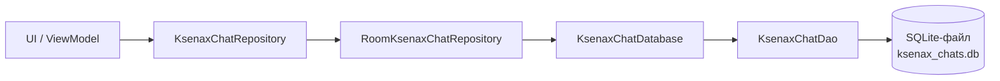

UI должен знать только `KsenaxChatRepository` и domain-модели. Он не должен
знать названия таблиц, писать SQL или работать с Room entity.

---

## Сначала главное: что такое Room

Room - библиотека Android Jetpack для работы с SQLite.

SQLite уже встроена в Android. Она хранит реляционную базу в локальном файле
внутри приложения. Room находится между Kotlin-кодом и SQLite:

```text
Kotlin-код -> Room -> SQLite -> файл базы на устройстве
```

Room даёт:

- Kotlin-классы для строк таблиц;
- интерфейсы с SQL-запросами;
- проверку запросов во время сборки;
- генерацию реализации DAO;
- преобразование строк SQLite в Kotlin-объекты;
- транзакции;
- наблюдение за изменениями через `Flow`;
- контроль версий схемы и миграций.

Room не заменяет SQL. Запросы в `@Query` остаются SQL-запросами:

```kotlin
@Query("SELECT * FROM chats WHERE id = :chatId LIMIT 1")
fun observeChat(chatId: Long): Flow<KsenaxChatWithMessages?>
```

Room проверяет во время сборки:

- существует ли таблица `chats`;
- существует ли колонка `id`;
- можно ли преобразовать результат в `KsenaxChatWithMessages`;
- совпадают ли именованные параметры `:chatId` с параметрами Kotlin-функции.

В обычной работе с `SQLiteDatabase` разработчик сам пишет mapping из
`Cursor` в Kotlin-объекты. Room генерирует этот код.

---

## Room, SQLite и PostgreSQL: это разные уровни

Сравнивать Room напрямую с PostgreSQL не совсем точно:

- **Room** - Android-библиотека доступа к данным;
- **SQLite** - локальная база данных, с которой работает Room;
- **PostgreSQL** - отдельный сервер базы данных.

Корректное сравнение выглядит так:

```text
Android-приложение + Room + SQLite
против
Backend-приложение + JDBC/JPA + PostgreSQL
```

### Основные различия

| Вопрос | Room + SQLite | PostgreSQL |
|---|---|---|
| Где работает | Внутри Android-приложения | В отдельном серверном процессе |
| Где лежат данные | В файле приложения на устройстве | На сервере PostgreSQL |
| Нужна ли сеть | Нет | Обычно да |
| Кто имеет доступ | Одно приложение на устройстве | Много приложений и пользователей |
| Основной сценарий | Локальные настройки, кэш, офлайн-данные, история | Общая серверная система данных |
| Масштаб конкуренции | Несколько потоков одного приложения | Много одновременных клиентов |
| SQL-диалект | SQLite SQL | PostgreSQL SQL |
| Типы данных | Небольшая система affinities | Богатая строгая система типов |
| Миграции | Room migrations | Flyway, Liquibase или SQL-миграции |
| Контроль доступа | Android sandbox и шифрование при необходимости | Пользователи, роли, схемы, сетевые правила |
| Генерация API | Room генерирует DAO | JPA/Hibernate генерирует repository/ORM-слой |

### Что в SQL похоже

Обе базы понимают базовую реляционную модель:

- таблицы;
- строки и колонки;
- первичные и внешние ключи;
- индексы;
- `SELECT`, `INSERT`, `UPDATE`, `DELETE`;
- `WHERE`, `ORDER BY`, `JOIN`;
- транзакции.

Поэтому знание SQL из PostgreSQL переносится в Room. Нужно учитывать
ограничения и синтаксис SQLite.

### Что нельзя переносить механически

PostgreSQL поддерживает возможности, которых нет в обычной SQLite:

- серверные пользователи и роли;
- схемы вроде `public`, `audit`, `billing`;
- сетевые подключения;
- хранимые процедуры и развитый PL/pgSQL;
- расширения;
- богатые типы вроде `JSONB`, массивов и `UUID`;
- сложную серверную конкуренцию;
- репликацию и серверное резервное копирование.

SQLite ориентирована на локальный файл. Для истории чатов одного пользователя
на одном телефоне это подходящая модель.

---

## Сопоставление с JPA и JpaRepository

Если ты знаешь Spring Data JPA, используй такую карту:

| Spring / JPA | Room | Роль |
|---|---|---|
| `@Entity` | `@Entity` | Описывает таблицу |
| `@Id` | `@PrimaryKey` | Первичный ключ |
| `@Column` | `@ColumnInfo` | Настройка колонки |
| `@OneToMany` | `@Relation` | Описание связи для чтения |
| `JpaRepository` | `@Dao` | API запросов к базе |
| `@Query` с JPQL/native SQL | `@Query` с SQLite SQL | Ручной запрос |
| `@Transactional` | `@Transaction` / `withTransaction` | Атомарная операция |
| `AttributeConverter` | `@TypeConverter` | Преобразование типов |
| Hibernate | Room compiler/runtime | Генерация mapping-кода |
| Flyway/Liquibase | `Migration` Room | Изменение схемы |

Главное отличие от `JpaRepository`: Room не выдаёт готовый универсальный
repository с полным CRUD API. Разработчик объявляет нужные операции в DAO:

```kotlin
@Dao
interface KsenaxChatDao {

    @Insert
    suspend fun insertChat(chat: KsenaxChatEntity): Long

    @Query("DELETE FROM chats WHERE id = :chatId")
    suspend fun deleteChat(chatId: Long)
}
```

Room генерирует реализацию именно этих методов.

Ещё одно отличие: Room `@Query` принимает SQLite SQL, а не JPQL. Имена
`chats`, `chat_messages`, `chat_id` относятся к реальной схеме базы.

---

## Одна база, а не отдельный Room на каждый чат

Для каждого чата не создаётся отдельная Room-база. Приложение использует один
файл:

```text
ksenax_chats.db
```

В нём две таблицы:

```text
chats
chat_messages
```

Один чат занимает одну строку в `chats`. Каждое сообщение занимает отдельную
строку в `chat_messages`.

Пример данных:

### Таблица `chats`

| id | mode | title | created_at_epoch_millis | updated_at_epoch_millis |
|---:|---|---|---:|---:|
| 1 | Basic | Как работает Room? | 1000 | 1400 |
| 2 | Agentic | Создай заметку | 2000 | 2600 |

### Таблица `chat_messages`

| id | chat_id | role | text | position | is_final_agentic_step |
|---:|---:|---|---|---:|---:|
| 10 | 1 | User | Как работает Room? | 0 | 0 |
| 11 | 1 | Assistant | Room работает поверх SQLite... | 1 | 0 |
| 12 | 2 | User | Создай заметку | 0 | 0 |
| 13 | 2 | Assistant | Проверяю путь... | 1 | 0 |
| 14 | 2 | Tool | Файл создан | 2 | 0 |
| 15 | 2 | Assistant | Готово | 3 | 1 |

Колонка `chat_id` связывает сообщение с чатом:

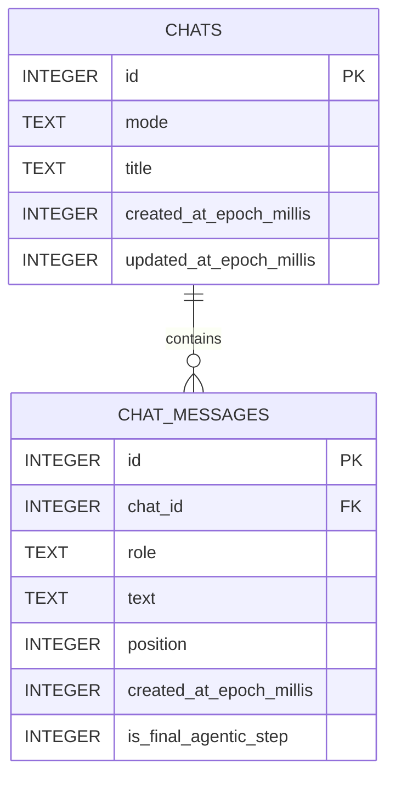

Обозначение `||--o{` читается так:

- одно сообщение принадлежит одному чату;
- чат может содержать ноль или много сообщений.

---

## Почему чаты и сообщения лежат в разных таблицах

История сообщений представляет отношение «один ко многим»:

```text
один chat -> много messages
```

Хранить весь список сообщений строкой JSON внутри `chats` было бы проще только
в начале. Затем возникли бы проблемы:

- для добавления одного сообщения пришлось бы переписывать весь JSON;
- база не смогла бы индексировать отдельные сообщения;
- внешний ключ и каскадное удаление исчезли бы;
- запросы по ролям и времени стали бы сложнее;
- повреждение одного большого значения затронуло бы всю историю.

Две таблицы дают нормальную реляционную модель. Чат хранит метаданные, сообщение
хранит один элемент истории.

---

## Реальная схема проекта

Room экспортирует схемы версий `1` и `2`:

```text
app/schemas/
└── com.kolesnikovprod.ksetaorch.storage.chat.data.local.KsenaxChatDatabase/
    ├── 1.json
    └── 2.json
```

Этот JSON фиксирует SQL, который Room сгенерировал для таблиц, индексов и
внешнего ключа. Его стоит хранить в Git: он нужен для проверки миграций.

### Таблица `chats`

Room создаёт:

```sql
CREATE TABLE chats (
    id INTEGER PRIMARY KEY AUTOINCREMENT NOT NULL,
    mode TEXT NOT NULL,
    title TEXT NOT NULL,
    created_at_epoch_millis INTEGER NOT NULL,
    updated_at_epoch_millis INTEGER NOT NULL
);
```

Индекс:

```sql
CREATE INDEX index_chats_updated_at_epoch_millis
ON chats(updated_at_epoch_millis);
```

Он ускоряет запрос списка чатов:

```sql
SELECT *
FROM chats
ORDER BY updated_at_epoch_millis DESC;
```

### Таблица `chat_messages`

Упрощённый SQL:

```sql
CREATE TABLE chat_messages (
    id INTEGER PRIMARY KEY AUTOINCREMENT NOT NULL,
    chat_id INTEGER NOT NULL,
    role TEXT NOT NULL,
    text TEXT NOT NULL,
    position INTEGER NOT NULL,
    created_at_epoch_millis INTEGER NOT NULL,
    generation_duration_millis INTEGER,
    is_final_agentic_step INTEGER NOT NULL,
    FOREIGN KEY(chat_id) REFERENCES chats(id) ON DELETE CASCADE
);
```

Индексы:

```sql
CREATE INDEX index_chat_messages_chat_id
ON chat_messages(chat_id);

CREATE UNIQUE INDEX index_chat_messages_chat_id_position
ON chat_messages(chat_id, position);
```

Первый индекс ускоряет поиск сообщений по чату.

Второй индекс запрещает двум сообщениям одного чата занимать одну позицию:

```text
(chat_id = 7, position = 3)
```

Такая пара может существовать только один раз.

---

## Как Kotlin-типы попадают в SQLite

SQLite использует несколько основных storage classes: `NULL`, `INTEGER`,
`REAL`, `TEXT`, `BLOB`.

В этой схеме mapping выглядит так:

| Kotlin | SQLite | Пример |
|---|---|---|
| `Long` | `INTEGER` | `id`, timestamp, position |
| `String` | `TEXT` | title, message text |
| `Boolean` | `INTEGER` | `0` или `1` |
| enum | `TEXT` через converter | `Basic`, `Assistant` |

`KsenaxChatTypeConverters` сохраняет enum через `.name`:

```kotlin
@TypeConverter
fun chatModeToString(mode: KsenaxStoredChatMode): String = mode.name
```

Поэтому `KsenaxStoredChatMode.Basic` превращается в строку `"Basic"`.

Обратное преобразование:

```kotlin
@TypeConverter
fun stringToChatMode(value: String): KsenaxStoredChatMode {
    return enumValueOf(value)
}
```

Практическое следствие: нельзя без миграции переименовать `Basic` в
`Regular`. Старые строки базы продолжат содержать `"Basic"`, а `enumValueOf`
не найдёт такой константы в новой версии приложения.

---

## API `androidx.room`: классы и аннотации проекта

В исходниках используется пакет `androidx.room`. В проекте подключены:

```kotlin
implementation(libs.androidx.room.runtime)
implementation(libs.androidx.room.ktx)
ksp(libs.androidx.room.compiler)
```

- `room-runtime` содержит основной API;
- `room-ktx` добавляет coroutine и Kotlin extensions;
- `room-compiler` через KSP генерирует код во время сборки.

Текущая версия Room задаётся в `gradle/libs.versions.toml`.

### `@Database`

Используется в `KsenaxChatDatabase`:

```kotlin
@Database(
    entities = [
        KsenaxChatEntity::class,
        KsenaxMessageEntity::class,
    ],
    version = 2,
    exportSchema = true,
)
abstract class KsenaxChatDatabase : RoomDatabase()
```

Параметры:

- `entities` перечисляет таблицы базы;
- `version` задаёт версию схемы;
- `exportSchema = true` включает экспорт JSON-схемы.

Класс базы наследуется от `RoomDatabase`. Room генерирует его реализацию.

### `Room.databaseBuilder`

База создаётся так:

```kotlin
Room.databaseBuilder(
    context.applicationContext,
    KsenaxChatDatabase::class.java,
    "ksenax_chats.db",
).build()
```

Параметры:

1. application context;
2. класс Room-базы;
3. имя файла SQLite.

`create()` каждый раз строит новый объект базы. Поэтому application graph
должен вызвать его один раз и переиспользовать экземпляр. Создавать новую базу
для каждого экрана или чата не нужно.

### `@Entity`

Объявляет Kotlin-класс таблицей:

```kotlin
@Entity(tableName = "chats")
data class KsenaxChatEntity(...)
```

Один объект `KsenaxChatEntity` соответствует одной строке `chats`.

Room entity не обязана совпадать с UI или domain-моделью. В этом проекте слои
разделены:

```text
KsenaxChatEntity  -> модель таблицы
KsenaxStoredChat  -> domain-модель хранения
KsenaxChat        -> UI-модель
```

### `@PrimaryKey`

Обозначает первичный ключ:

```kotlin
@PrimaryKey(autoGenerate = true)
val id: Long = 0L
```

`autoGenerate = true` просит SQLite назначать идентификатор при вставке. Для
новой entity используется `id = 0L`.

### `@ColumnInfo`

Настраивает колонку:

```kotlin
@ColumnInfo(name = "chat_id")
val chatId: Long
```

Kotlin использует `camelCase`, а SQL-схема использует `snake_case`.

`@ColumnInfo(index = true)` создаёт обычный индекс:

```kotlin
@ColumnInfo(name = "updated_at_epoch_millis", index = true)
val updatedAtEpochMillis: Long
```

### `ForeignKey`

Объявляет внешний ключ:

```kotlin
ForeignKey(
    entity = KsenaxChatEntity::class,
    parentColumns = ["id"],
    childColumns = ["chat_id"],
    onDelete = ForeignKey.CASCADE,
)
```

Связь:

```text
chat_messages.chat_id -> chats.id
```

`CASCADE` означает: при удалении строки чата SQLite сама удалит все сообщения
с этим `chat_id`.

Без внешнего ключа можно было бы получить сообщения-сироты, которые ссылаются
на несуществующий чат.

### `Index`

Создаёт индекс:

```kotlin
Index(value = ["chat_id"])
Index(value = ["chat_id", "position"], unique = true)
```

Индекс ускоряет чтение ценой дополнительной работы при записи и места в файле
базы. `unique = true` также вводит ограничение уникальности.

### `@Dao`

DAO расшифровывается как Data Access Object:

```kotlin
@Dao
interface KsenaxChatDao
```

DAO описывает операции низкого уровня над таблицами. Он принимает и возвращает
Room entity. UI не должен обращаться к DAO напрямую.

Room генерирует класс, реализующий этот интерфейс.

### `@Query`

Связывает функцию с SQL:

```kotlin
@Query("DELETE FROM chats WHERE id = :chatId")
suspend fun deleteChat(chatId: Long)
```

`:chatId` является именованным SQL-параметром. Room безопасно передаст значение
из аргумента Kotlin. Склеивать SQL-строку вручную не нужно.

Многострочный запрос:

```kotlin
@Query(
    """
    SELECT COALESCE(MAX(position), -1) + 1
    FROM chat_messages
    WHERE chat_id = :chatId
    """
)
suspend fun nextMessagePosition(chatId: Long): Long
```

Для пустого чата `MAX(position)` возвращает `NULL`. `COALESCE(..., -1)`
заменяет его на `-1`, после прибавления единицы первая позиция равна `0`.

### `@Insert`

Генерирует `INSERT`:

```kotlin
@Insert
suspend fun insertMessage(message: KsenaxMessageEntity): Long
```

Возвращаемый `Long` содержит сгенерированный `id`.

В проекте не указан `onConflict`, поэтому действует стратегия `ABORT`.
Нарушение первичного ключа, внешнего ключа или уникального индекса прервёт
операцию исключением.

### `@Update`

Генерирует `UPDATE` по первичному ключу:

```kotlin
@Update
suspend fun updateChat(chat: KsenaxChatEntity): Int
```

Возвращаемый `Int` содержит число изменённых строк. Если чат с таким `id` не
найден, результат равен `0`.

### `@Transaction`

У `@Transaction` два сценария.

Первый: прочитать объект со связями в согласованном состоянии:

```kotlin
@Transaction
@Query("SELECT * FROM chats WHERE id = :chatId LIMIT 1")
fun observeChat(chatId: Long): Flow<KsenaxChatWithMessages?>
```

Room сначала читает чат, затем связанные сообщения. Транзакция не позволяет
увидеть половину изменения между этими запросами.

Второй сценарий: пометить DAO-метод, который вызывает несколько других
операций. В текущем проекте составные операции находятся в repository и
используют `withTransaction`.

### `withTransaction`

Kotlin extension из `room-ktx`:

```kotlin
database.withTransaction {
    chatDao.deleteMessages(chatId)
    chatDao.insertMessages(messages)
}
```

Все операции внутри блока завершаются вместе:

- при успехе Room фиксирует изменения;
- при исключении Room откатывает весь блок.

Для `saveChat()` это критично. Без транзакции приложение могло бы удалить
старые сообщения, упасть до вставки новых и оставить чат пустым.

### `@TypeConverters`

Подключает набор converters к базе:

```kotlin
@TypeConverters(KsenaxChatTypeConverters::class)
abstract class KsenaxChatDatabase : RoomDatabase()
```

После этого Room может применять converters ко всем подходящим полям базы.

### `@TypeConverter`

Помечает одну функцию преобразования:

```kotlin
@TypeConverter
fun messageRoleToString(role: KsenaxMessageRole): String = role.name
```

Для каждого нестандартного типа нужны оба направления:

```text
Kotlin -> SQLite
SQLite -> Kotlin
```

### `@Embedded`

Встраивает поля одного объекта в составной результат:

```kotlin
data class KsenaxChatWithMessages(
    @Embedded
    val chat: KsenaxChatEntity,
    ...
)
```

Поля строки `chats`, которую вернул основной `SELECT`, собираются в `chat`.

`@Embedded` сам по себе не выполняет связь с другой таблицей.

### `@Relation`

Описывает, как Room догружает связанные entity:

```kotlin
@Relation(
    parentColumn = "id",
    entityColumn = "chat_id",
)
val messages: List<KsenaxMessageEntity>
```

Room сопоставляет:

```text
KsenaxChatEntity.id
          =
KsenaxMessageEntity.chat_id
```

`@Relation` относится к чтению объектного графа. Ограничение целостности в
самой SQLite задаёт `ForeignKey` внутри `@Entity`.

Это две разные обязанности:

```text
@Relation   -> как Room читает связанные объекты
ForeignKey  -> как SQLite защищает связь в данных
```

---

## Зачем нужны три вида моделей

В пакете существуют Room entity и domain-модели. В UI есть собственные модели.
Это осознанное разделение границ.

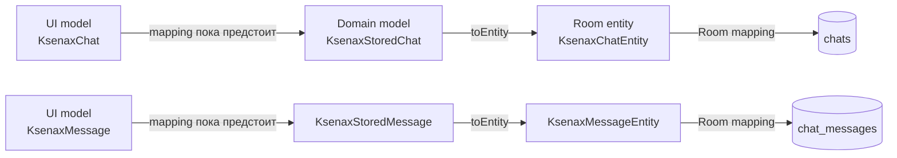

Почему не использовать `KsenaxChatEntity` везде:

- UI не должен зависеть от Room;
- domain не должен знать названия SQL-колонок;
- схема базы может меняться отдельно от представления экрана;
- repository становится точкой преобразования и проверки данных;
- тесты domain/UI не требуют Android Room runtime.

`KsenaxChatRepository` является границей:

```kotlin
interface KsenaxChatRepository {
    val chats: Flow<List<KsenaxStoredChat>>
    fun observeChat(chatId: Long): Flow<KsenaxStoredChat?>
    suspend fun saveChat(chat: KsenaxStoredChat): Long
    suspend fun appendMessage(
        chatId: Long,
        message: KsenaxStoredMessage,
    ): Long
    suspend fun deleteChat(chatId: Long)
}
```

Снаружи видно поведение хранилища. Детали Room остаются в `data`.

---

## Как читаются чаты

DAO возвращает:

```kotlin
fun observeChats(): Flow<List<KsenaxChatWithMessages>>
```

`Flow` здесь означает поток обновлений, а не одноразовый результат.

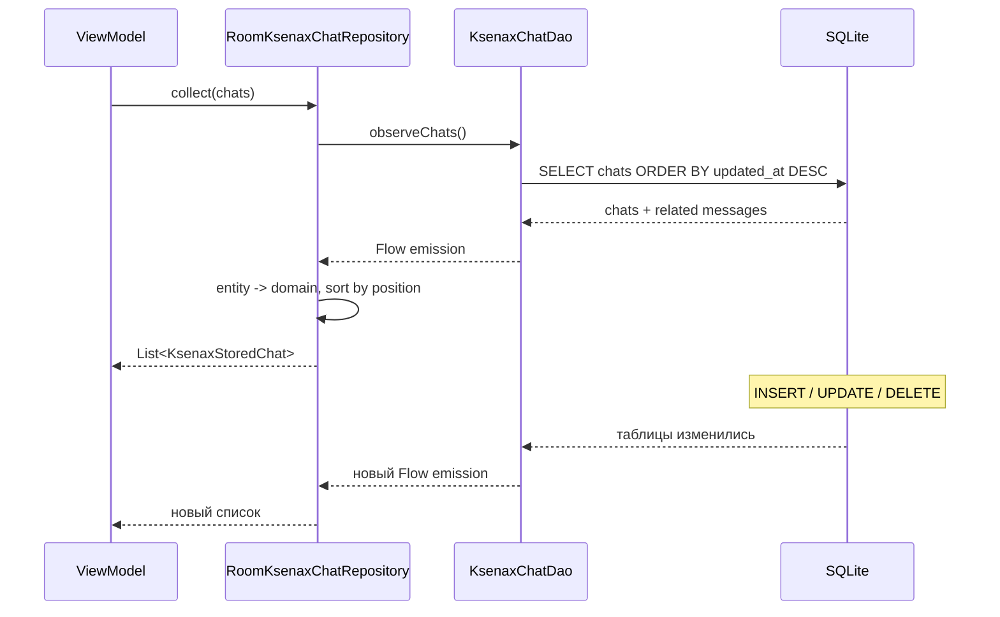

Room отслеживает таблицы, затронутые запросом. После записи в них Room повторно
выполняет запрос и отправляет новое значение подписчикам.

Repository сортирует сообщения:

```kotlin
messages
    .sortedBy(KsenaxMessageEntity::position)
    .map(KsenaxMessageEntity::toDomain)
```

Это нужно, потому что `@Relation` не задаёт `ORDER BY` для списка сообщений.

---

## Как сохраняется полный чат

`RoomKsenaxChatRepository.saveChat()` выполняет операцию в одной транзакции:

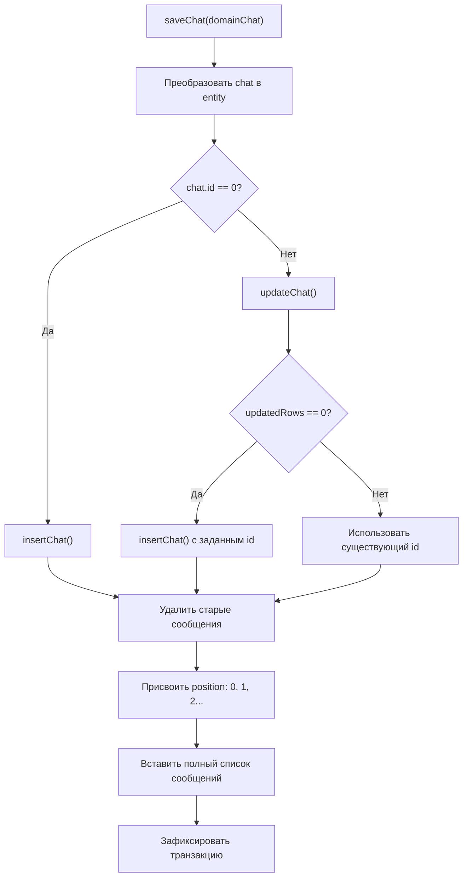

Алгоритм использует стратегию полной замены истории:

1. создать или обновить строку чата;
2. удалить все прежние сообщения;
3. вставить переданный список заново.

Плюс: состояние базы после операции точно совпадает с переданным
`KsenaxStoredChat`.

Минус: обновление одного поля чата переписывает всю историю. Для небольшого MVP
это понятно и надёжно. Для длинных чатов лучше обновлять метаданные отдельно, а
новые сообщения добавлять через `appendMessage()`.

---

## Как добавляется одно сообщение

`appendMessage()` также работает в транзакции:

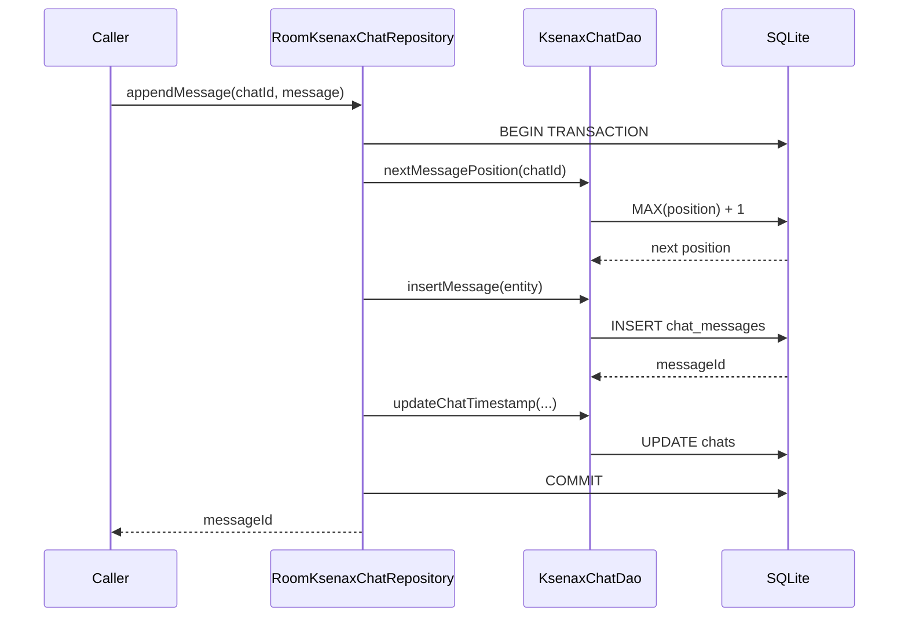

Транзакция защищает вычисление позиции и вставку. Она также гарантирует, что
сообщение и `updated_at_epoch_millis` обновятся вместе.

Обновление timestamp перемещает активный чат вверх списка, потому что список
сортируется по `updated_at_epoch_millis DESC`.

---

## Как удаляется чат

Repository вызывает:

```sql
DELETE FROM chats WHERE id = :chatId;
```

Отдельный запрос удаления сообщений не нужен. SQLite применяет:

```sql
ON DELETE CASCADE
```

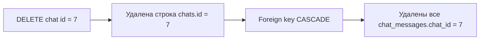

---

## `suspend` и `Flow`

Room API использует два разных режима.

### `suspend`: одна операция

```kotlin
suspend fun insertChat(chat: KsenaxChatEntity): Long
```

Функция выполняет запрос и возвращает один результат. Её вызывают из coroutine,
например из `viewModelScope.launch`.

Подходит для:

- вставки;
- обновления;
- удаления;
- одноразового чтения.

### `Flow`: наблюдение

```kotlin
fun observeChat(chatId: Long): Flow<KsenaxChatWithMessages?>
```

Функция возвращает поток. Запрос остаётся наблюдаемым до отмены collection.

Подходит для:

- списка чатов на экране;
- активного чата;
- автоматического обновления Compose state после записи.

Само получение `Flow` не запускает бесконечный фоновый поток. Работа начинается,
когда consumer вызывает `collect`, `stateIn`, `collectAsStateWithLifecycle` или
другой terminal/state operator.

---

## Текущее состояние интеграции

Room storage подключён к отдельным navigation destination Basic- и
Agentic-чатов.

Текущие runtime-потоки:

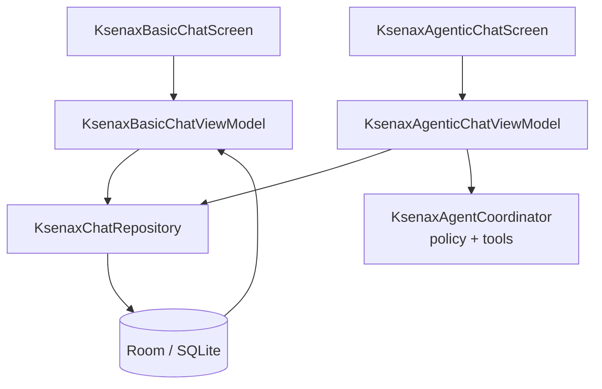

`KsenaxAndroidApplication` владеет одной process-scoped цепочкой:

```text
KsenaxAndroidApplication
    -> KsenaxChatDatabase
    -> RoomKsenaxChatRepository
    -> Basic / Agentic ViewModel Factory
    -> Basic / Agentic Screen
```

Streaming-текст остаётся presentation state и записывается одним assistant-
сообщением после завершения или остановки генерации.

---

## Как должен выглядеть целевой поток

После интеграции источник истины для сохранённых чатов должен находиться в
repository:

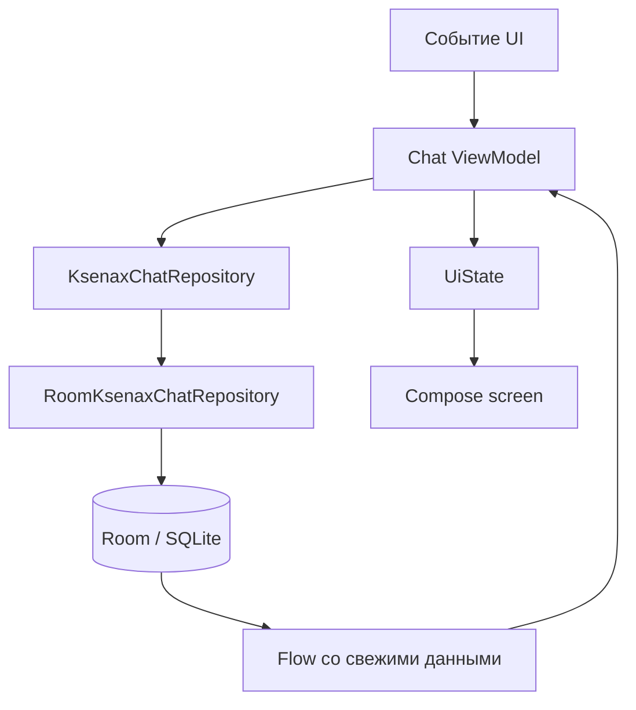

Один практичный порядок подключения:

1. создать один `KsenaxChatDatabase` на процесс приложения;
2. создать один `RoomKsenaxChatRepository`;
3. передать repository во ViewModel через factory или DI;
4. преобразовать `KsenaxStoredChat` в UI-модель;
5. подписать ViewModel на `repository.chats`;
6. заменить изменение in-memory списка на `saveChat()` и `appendMessage()`;
7. оставить UI state проекцией данных repository и временного состояния экрана.

Repository не должен хранить:

- открыта ли боковая панель;
- текст, который пользователь ещё не отправил;
- состояние кнопок и анимаций;
- текущий streaming token до решения о persistence.

Это presentation state. В базе должны лежать данные, которые нужны после
перезапуска приложения.

---

## Жизненный цикл базы

`KsenaxChatDatabase.create(context)` использует `applicationContext`, что
защищает от удержания `Activity`.

Но метод не является singleton. Если вызвать его в нескольких ViewModel,
появятся несколько объектов `RoomDatabase` для одного файла.

Нужная ownership-модель:

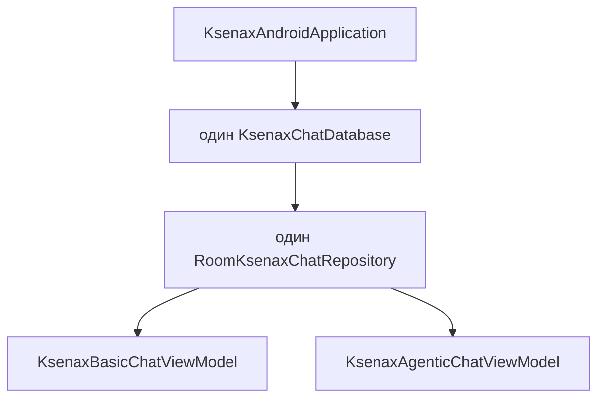

Закрывать базу после каждого запроса не нужно. Обычно Android-приложение держит
её открытой весь срок жизни процесса.

---

## Версии схемы и миграции

Сейчас:

```kotlin
version = 2
```

Миграция `1 -> 2` добавляет nullable-колонку времени генерации:

```sql
ALTER TABLE chat_messages
ADD COLUMN generation_duration_millis INTEGER;
```

Если добавить колонку, таблицу, индекс или изменить constraint, нужно:

1. увеличить версию базы;
2. написать `Migration`;
3. передать migration в builder;
4. проверить старую и новую схему;
5. сохранить новый schema JSON.

Пример следующей миграции:

```kotlin
val Migration2To3 = object : Migration(2, 3) {
    override fun migrate(db: SupportSQLiteDatabase) {
        db.execSQL(
            "ALTER TABLE chats ADD COLUMN archived INTEGER NOT NULL DEFAULT 0"
        )
    }
}
```

Подключение:

```kotlin
Room.databaseBuilder(...)
    .addMigrations(Migration1To2, Migration2To3)
    .build()
```

Простое изменение `version = 3` без migration приведёт к ошибке открытия базы
у пользователя, который обновил приложение с версии схемы `2`.

`fallbackToDestructiveMigration()` удаляет старую базу и создаёт новую. Для
истории чатов это означает потерю данных, поэтому такой fallback нельзя
добавлять как бездумное исправление ошибки миграции.

---

## Ограничения и решения текущей схемы

### Порядок сообщений хранится отдельно

`created_at_epoch_millis` не подходит как единственный порядок:

- два сообщения могут получить одинаковое время;
- системные и tool-сообщения могут создаваться почти одновременно;
- время устройства может измениться.

Поэтому схема хранит явный `position`.

### Agentic-шаги являются сообщениями

Роли:

```text
User
Assistant
System
Tool
```

`isFinalAgenticStep` позволяет UI выделить финальный ответ агентного сценария.
Для MVP этого достаточно. Если понадобятся статусы tool call, аргументы,
подтверждения и ошибки, лучше добавить отдельную структурированную модель, а не
кодировать всё в `text`.

### Режим принадлежит чату

`KsenaxStoredChatMode` хранит:

```text
Basic
Agentic
```

Режим записан на уровне чата, поэтому сообщения не дублируют его. Это сохраняет
инвариант: один диалог работает в одном режиме.

Если продукт разрешит менять режим посреди истории, придётся решить:

- меняется режим всего чата;
- режим фиксируется у каждого сообщения;
- переключение создаёт новый чат или ветку.

Текущая схема выбирает первый и самый простой вариант.

### Полная замена истории может стать дорогой

`saveChat()` удаляет и вставляет сообщения заново. Для коротких локальных
диалогов это приемлемо. При росте истории лучше разделить команды:

```text
createChat()
updateChatMetadata()
appendMessage()
updateMessage()
deleteMessage()
```

`appendMessage()` уже реализует самый частый дешёвый путь.

### Поиск по тексту пока не предусмотрен

Обычный `LIKE '%text%'` возможен, но на большой истории станет медленным. Если
понадобится полнотекстовый поиск, SQLite и Room поддерживают FTS entity.
Добавлять FTS до появления пользовательского сценария поиска не нужно.

### Шифрование не входит в Room по умолчанию

Android sandbox закрывает файл базы от обычных сторонних приложений, но Room
сам не шифрует содержимое. Для чувствительной истории нужна отдельная модель
угроз и подходящее решение шифрования.

---

## Инварианты, которые стоит защищать

Хорошая схема хранит данные и защищает правила их целостности.

Текущие инварианты:

1. сообщение не существует без чата;
2. удаление чата удаляет его сообщения;
3. позиция сообщения уникальна внутри чата;
4. новые сообщения добавляются после текущей максимальной позиции;
5. изменение истории обновляет timestamp чата;
6. список чатов сортируется по последнему изменению;
7. domain-слой не зависит от Room;
8. UI не работает с DAO и entity напрямую.

Полезные будущие проверки:

- нельзя добавить сообщение в несуществующий чат;
- `updatedAtEpochMillis` не меньше `createdAtEpochMillis`;
- пустой title нормализуется до осмысленного значения;
- слишком большой текст не ломает UI и export;
- migration сохраняет историю и порядок сообщений.

---

## Как читать код по порядку

Если ты изучаешь Room после `JpaRepository`, не начинай с generated SQL.
Пройди поток сверху вниз:

1. `domain/KsenaxChatRepository.kt`
   - пойми, что хранилище обещает остальному приложению;
2. `domain/model/KsenaxStoredChat.kt`
   - посмотри модель чата;
3. `domain/model/KsenaxStoredMessage.kt`
   - посмотри модель сообщения и роли;
4. `data/RoomKsenaxChatRepository.kt`
   - изучи транзакции и mapping;
5. `data/local/KsenaxChatDao.kt`
   - прочитай реальные SQL-запросы;
6. `data/local/entity/KsenaxChatEntity.kt`
   - сопоставь Kotlin-поля с `chats`;
7. `data/local/entity/KsenaxMessageEntity.kt`
   - разберись с foreign key и индексами;
8. `data/local/entity/KsenaxChatWithMessages.kt`
   - посмотри, как Room собирает отношение;
9. `data/local/KsenaxChatTypeConverters.kt`
   - проследи преобразование enum;
10. `data/local/KsenaxChatDatabase.kt`
    - заверши картину конфигурацией базы;
11. `app/schemas/.../1.json`
    - сравни аннотации с итоговым SQL.

Такой порядок показывает ответственность каждого слоя, а не оставляет набор
аннотаций без связи.

---

## Короткая проверка понимания

После чтения попробуй ответить без подсказки:

1. Почему чат и сообщения не хранятся в отдельных Room-базах?
2. Кто генерирует реализацию `KsenaxChatDao`?
3. Чем `@Relation` отличается от `ForeignKey`?
4. Почему `observeChats()` возвращает `Flow`, а `insertChat()` является
   `suspend`-функцией?
5. Что произойдёт с сообщениями после удаления чата?
6. Зачем нужен уникальный индекс `(chat_id, position)`?
7. Почему переименование enum-константы требует миграции данных?
8. Зачем repository преобразует entity в domain-модель?
9. Что защищает `withTransaction` внутри `saveChat()`?
10. Почему текущий UI всё ещё теряет чаты после завершения процесса?

Если ответы ясны, базовая ментальная модель Room уже собрана.

---

## Итоговая карта

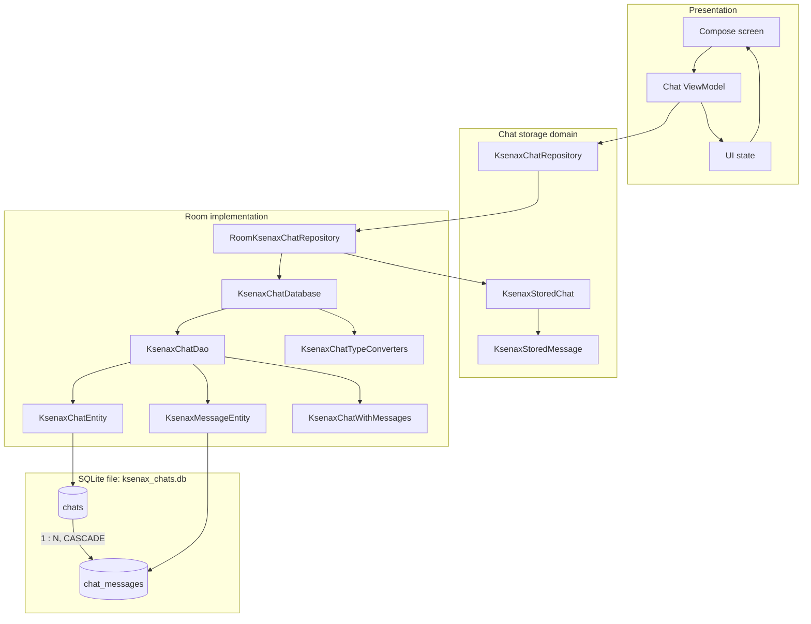

Короткая формула всей директории:

```text
domain задаёт контракт
repository управляет сценарием хранения и mapping
DAO описывает SQL
entity описывает таблицы
Room генерирует plumbing
SQLite хранит данные в локальном файле
```
